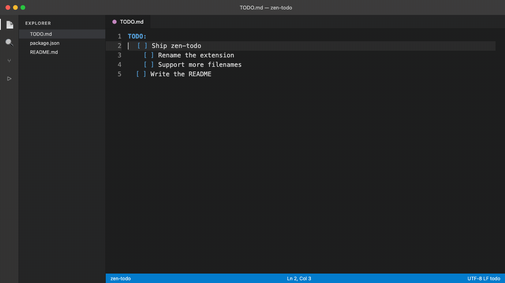

# zen-todo

A small, local-only replacement for the TODO+ extension. It only does a few
things:




1. Recognises `TODO` / `todo` files, `TODO.md` / `todo.md`, and `*.todo`
   as a `todo` language, with basic colour coding:
   - Section headers (e.g. `TODO:`, `Archive:`) are highlighted as headings.
   - `[ ]` open checkboxes get a distinct "keyword" colour.
   - `[x]` completed items (box, text, and any `@done(...)` tag) are
     rendered struck-through.
   - `@tag(...)` annotations (e.g. `@started(...)`, `@done(...)`) get a
     distinct colour.
   - Plain note/bullet lines (`  - some detail`) are rendered like comments.
   - An open item tagged `@started(...)` is rendered in orange (the
     "string" colour) to flag it as in progress.
   - Exact colours depend on your current colour theme, since the grammar
     just maps onto standard TextMate scopes (`markup.heading`,
     `keyword.control`, `markup.strikethrough`, `constant.other.tag`,
     `comment.line`, `string.unquoted`).
2. **Option+D** (`alt+d`) toggles the `[ ]`/`[x]` checkbox on the current
   line:
   - Cascades the new state to every nested sub-item under it.
   - Rolls the new state up to every ancestor: a parent becomes checked only
     when *all* of its direct children are checked, and un-checks again as
     soon as any child is unchecked.
   - Checking an item stamps it with `@done(YY-MM-DD HH:mm)` (matching the
     existing `@started(...)` convention); unchecking removes that stamp.
3. **Option+S** (`alt+s`) toggles an `@started(YY-MM-DD HH:mm)` tag on the
   cursor's item, to mark it as in progress (turns it orange — see above).
   Pressing it again on an already-started item removes the tag.
4. **Command Palette → "Zen TODO: Archive Completed"** moves every top-level
   item that is fully checked (itself and all descendants) into an
   `Archive:` section at the end of the file. Items that are only partially
   done — even if some of their children are finished — are left exactly
   where they are.

Checking an item plays a short check-pop in the editor. Archiving shows a
toast that names the items that moved.

If [Todo+](https://marketplace.visualstudio.com/items?itemName=fabiospampinato.vscode-todo-plus)
is also installed, it binds the same ⌥D / ⌥S keys on todo files. Use the
**Zen TODO:** commands from the Command Palette if those keys do not run
this extension.

Nesting is arbitrary-depth and purely indentation-based; no fixed section
name is assumed. Plain (non-checkbox) lines, such as notes or bullet points
under an item, travel with that item when it's toggled/cascaded or archived.

The extension never leaves your machine: no telemetry, no network, no
cloud sync. Your list is the file in front of you.

## Format

```
TODO:
  [ ] PTs
    [ ] Review PTs raised by the team
    [ ] Follow up on any outstanding PTs
  [ ] Ask Talkdesk if SMS delivery status can be sent to us via webhooks
```

## Develop / run

```sh
npm install
npm run compile   # or: npm run watch
```

Press **F5** in VS Code (with this folder open) to launch an Extension
Development Host with the extension loaded, then open a `TODO`, `TODO.md`,
or `*.todo` file.

## Install locally (without the Marketplace)

Compile, package, and force-install into VS Code:

```sh
npm install
npm run reinstall
```

Then **Developer: Reload Window**. That script is the only local install path;
it always writes `zen-todo.vsix` and runs `code --install-extension --force`.

## Deliberately out of scope

No settings or automated test suite — kept intentionally minimal.

## Publishing / sharing with others

### 1. Share a `.vsix` via GitHub

```sh
npm install
npm run package
```

Attach the generated `zen-todo.vsix` to a
[GitHub Release](https://github.com/josh08h/zen-todo/releases).
Others install it with:

```sh
code --install-extension zen-todo.vsix
```

### 2. Publish to the official VS Code Marketplace

1. Create an Azure DevOps organisation and a
   [Personal Access Token](https://code.visualstudio.com/api/working-with-extensions/publishing-extension#get-a-personal-access-token)
   with **Marketplace (Manage)** scope.
2. Register a publisher: `npx @vscode/vsce create-publisher josh08h`
   (or via https://marketplace.visualstudio.com/manage). The `"publisher"`
   field in `package.json` is already set to `josh08h`.
3. Add an `"icon"` field pointing at a 128×128 PNG for the Marketplace
   listing (optional but recommended).
4. Log in and publish:
   ```sh
   npx @vscode/vsce login josh08h
   npx @vscode/vsce publish
   ```
5. From then on, bump versions with `vsce publish patch|minor|major`.

## License

MIT. See [LICENSE](LICENSE).
